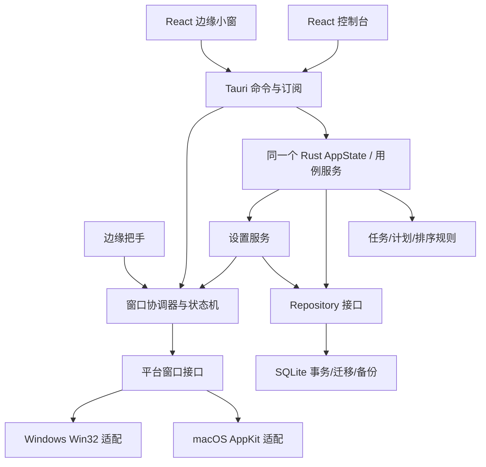

# 技术架构候选

状态：目标架构。已进入原型实现，实际分层、差距见 [ADR-0003](../decisions/0003-prototype-implementation.md) 与 [STATUS](../delivery/STATUS.md)；本文完整行为不能视为全部已实现。当前已有schema2安全备份、按窗口IPC权限、固定DDL和退出握手，见[ADR-0004](../decisions/0004-data-safety-and-fixed-deadlines.md)。第一版同时支持两平台、只管理独立大任务、同时提供控制台和边缘小窗，已由用户明确。技术栈与复用方式待 POC 决定，见 [ADR-0001](../decisions/0001-platform-and-reuse.md)；窗口职责和任务范围见 [ADR-0002](../decisions/0002-console-and-edge-panel.md)。

## 选型

| 方案 | 优点 | 代价/判断 |
| --- | --- | --- |
| Tauri 2 + React/TypeScript + Rust | 两平台共享界面和任务核心；能接原生窗口能力 | 悬停不抢焦点、DPI、全屏仍需平台适配；首选候选 |
| SwiftUI + AppKit | Mac 窗口语义直接 | 不能单独实现 Windows 首版；AppKit 可作为 Tauri 平台层的实现 |
| Electron | 共享界面、生态广 | 资源占用和边缘窗口行为仍需验证；如果 Tauri POC 遇到实质阻断再评估 |
| 整体 fork Todobar | 已有两平台产品壳与发布流程 | 需要补窗口和数据核心；先做有边界的复用评估 |

依赖版本在初始化时锁定。当前不为尚未生成的项目编造版本号、安装命令或构建成功记录。

## 一个应用，两种用户界面

采用常见桌面工具的「完整管理窗口 + 常驻快捷面板」结构。控制台负责集中管理，小窗负责学习时快速查看和勾选；两者不是两套 App，也不各自保存一份任务。首版任务为扁平列表，不设计任务树、子任务、清单步骤或完成进度聚合。

| 原生窗口标签 | 用户职责 | 窗口行为 |
| --- | --- | --- |
| `console` | 今日安排、全部任务、DDL、已完成/最近删除、任务编辑和设置 | 普通大窗口；可移动、缩放、最小化/最大化；显式打开时正常取得焦点 |
| `edge-panel` | 上方今日、下方 DDL；快速完成/撤销和简短操作；进入控制台管理 | 小窗；可拖动停靠、悬停不抢焦点、离开收起、允许固定展开；停靠后遵守屏幕边界 |
| `edge-handle` | 小窗折叠后的边缘触发区 | 内部实现窗口，不是第三个管理界面；不进入任务切换器、不取得输入焦点、不访问任务内容 |

三个标签由 Rust 的 `WindowCoordinator` 统一持有和恢复，每个标签至多一个实例；设置是 `console` 内的页面，不另开常驻设置窗口。UI 请求「打开设置」或「打开任务详情」，由协调器显示/恢复已有控制台并跳转；不能每点一次就创建新窗口。Tauri 的普通多窗口可使用 `WebviewWindow`，窗口标签必须唯一；平台特殊小窗行为仍需适配。[Tauri 多窗口 API](https://v2.tauri.app/reference/javascript/api/namespacewebviewwindow/)、[窗口配置](https://v2.tauri.app/reference/config/#windowconfig)

### 生命周期与恢复入口

- 用户从应用图标启动或再次启动时，打开已有 `console`；首次使用在控制台完成基本配置。登录启动在已有配置下只恢复菜单栏/托盘和边缘入口，避免主动弹出大窗。单实例回调负责显示、取消最小化和聚焦，不能假定插件默认完成这些动作。[Tauri Single Instance](https://v2.tauri.app/plugin/single-instance/)
- 点击控制台关闭按钮表示隐藏控制台；保存成功或明确处理未保存草稿后，拦截关闭并隐藏。Rust 应用、数据库服务和边缘入口继续运行。边缘小窗关闭只表示收起并解除固定。
- 菜单栏/托盘保留「打开控制台」「显示/收起小窗」「设置」「退出 SideTask」。若托盘创建失败，不把唯一可恢复的控制台隐藏掉；保留可见错误和重试入口。[Tauri System Tray](https://v2.tauri.app/learn/system-tray/)
- 显式「退出 SideTask」才进入正常退出流程：暂停新悬停动作、处理编辑草稿（选择保存时仍允许该次提交），确认退出后停止接收新写入并等待在途事务，最后注销快捷键和托盘并结束应用。取消退出恢复正常操作。退出处理不能被“关闭即隐藏”规则重新拦截；系统关机/结束进程是另外的恢复场景，不承诺阻止系统退出。[Tauri WindowEvent](https://docs.rs/tauri/latest/tauri/enum.WindowEvent.html)、[RunEvent](https://docs.rs/tauri/latest/tauri/enum.RunEvent.html)

### 大小窗口的焦点协调

控制台获得焦点时，取消悬停展开计时，并收起未固定的小窗；小窗若正在编辑，应先保留/处理草稿，不粗暴隐藏输入。固定小窗可继续展示并接受明确的勾选，避免把控制台编辑复制到第二个表单。控制台在前台时，指针路过把手不会自动展开小窗；点击把手或快捷键属于显式意图，允许打开。离开控制台后恢复悬停能力，但要求指针先离开触发区再重新进入，防止刚关闭大窗就误弹小窗。

这些规则由同一个协调器处理 `consoleFocused`、`panelPinned`、交互保护和动作代次；不由两个 WebView 相互发“隐藏对方”消息。仅因小窗刷新任务、收到完成事件或应用设置，不应激活任何窗口。

## 分层与依赖方向



领域规则不依赖 UI 和系统窗口。前端不直接写数据库；窗口控制只接受明确的用户意图，不允许任意 shell 或文件访问。应用的一个 Rust 核心维护 Repository、用例服务和窗口协调器；各 WebView 仍可能运行在系统独立进程中，不能把“一个应用”误解为所有 UI 共用 JavaScript 内存。[Tauri Process Model](https://v2.tauri.app/concept/process-model/)、[State Management](https://v2.tauri.app/develop/state-management/)

SQLite 是任务和持久化设置的事实来源，React 状态只是各窗口自己的展示缓存。MVP 使用统一写入入口，窗口不直接操作 SQLite 或把 `localStorage` 当另一份主库。Task 只表示一项完整大任务；加入今日是同一 ID 的计划引用，勾选表示整个任务完成。

建议模块归属如下，先在现有单个桌面工程内划分，不为首版额外拆微服务或独立后台程序：

| 模块 | 职责 |
| --- | --- |
| `src/surfaces/console`、`src/surfaces/edge-panel` | 两种用户窗口的入口、布局和页面组合；把手由平台窗口层维护 |
| `src/features/tasks`、`daily-plan`、`settings` | 可共享 UI、交互与展示查询；无数据库或 OS 代码 |
| `src/lib/ipc` | 类型化命令、订阅生命周期、快照刷新、错误映射 |
| `src-tauri/src/application` | 任务/每日计划/设置用例、统一命令入口、快照协议 |
| `src-tauri/src/domain` | 扁平任务模型、DDL 和排序等规则 |
| `src-tauri/src/infrastructure` | SQLite Repository、事务、迁移和备份 |
| `src-tauri/src/platform` | 窗口协调器、几何/焦点/显示器/托盘/快捷键及两平台适配 |

共享的是业务规则、组件和协议，不是跨窗口可直接读写的前端 store。具体入口文件、依赖和命令在 B05 初始化后再补齐。

### 跨窗口一致性

所有编辑携带对应实体的 `expectedRevision`，写入时在同一事务校验、提交并递增修订号；完成/撤销使用明确目标状态，避免重复 toggle。旧表单与小窗并发冲突时返回当前已提交值和冲突类型，保留草稿并提示重新确认，禁止静默最后写入覆盖。

持久化状态另有事务级 `change_seq`，快照在同一读事务返回数据、序号和数据集代次。恢复备份会改变代次，旧序号不能用于比较新库。UI 先完成事件订阅，再请求快照；取快照期间缓存最新事件序号，若存在更新则再查询。只有同一代次且不早于当前快照的响应才能替换缓存。事件只通知“有变化”，不是任务事实、可靠消息队列或写成功凭证。重新显示、重新连接、睡眠恢复时重新取快照，事件发送失败不能把已经提交的事务误报为未提交。完整协议见 [数据模型](DATA_MODEL.md)。Tauri 支持事件向指定窗口分发，但这套一致性与恢复协议需要 SideTask 自己实现。[Tauri Rust → Frontend](https://v2.tauri.app/develop/calling-frontend/)

### 设备设置与生效状态

任务内容、计划关系和设备设置分别建模。屏幕/边缘/尺寸/延迟、控制台窗口位置、快捷键和登录启动等属于本机设置，不写入 Task。通过设置页换屏时先校验并提交，再隐藏小窗、应用新几何；提交失败保留旧设置和旧窗口状态。用户主动拖动则允许实时跨过接缝，在释放后重新停靠并持久化，不能用程序化迁移规则阻止用户移动。

数据库提交和 OS 窗口/快捷键操作不能组成同一个原子事务，所以返回结果区分「未保存」「已保存并生效」「已保存但应用失败」。应用失败时保留上一套安全的实际状态（没有安全状态则隐藏小窗，保留控制台/托盘入口），显示原因和重试；不把设置开关显示为已经生效。运行态记录 `appliedRevision` 和实际能力，重启后重新应用持久化期望值。主动拖动使用暂态位置，释放时校准为合法停靠矩形后保存；停靠状态缩放仍受边界约束。保存失败提示并恢复上一套合法持久化几何。区分系统回调与用户修改，避免回调写入循环。

### 按窗口限制系统能力

控制台允许完整任务管理和设置命令，小窗只获得完成/撤销、计划和快速新建等必要能力；完整任务编辑按 Task ID 跳转控制台，把手仅能请求展开/位置调整。窗口创建、退出、备份文件访问和系统设置由 Rust 入口集中校验。Tauri capability 以窗口标签划定权限；自定义应用命令默认可被各窗口调用，初始化时必须显式纳入权限清单或执行调用方校验，不能只隐藏按钮。事件只发给需要刷新的已知窗口，也不经事件触发可信写入。[Tauri Capabilities](https://v2.tauri.app/security/capabilities/)

## 多屏：不把「收起」实现成移出屏幕

以下防溢出规则适用于 `edge-panel`、`edge-handle` 停靠后的显示、展开/收起与缩放，以及相关弹层。显式 `DraggingDock` 状态允许用户主动移动经过屏幕接缝；释放/取消后先恢复合法停靠矩形，再恢复普通展开/收起规则。不能把“收起不溢出”实现成禁止移动或永久绑定某屏。`console` 是普通系统窗口，允许正常跨屏或横跨两屏；恢复时确保标题栏和基本操作区可见。

维护一个边缘面板与独立的窄把手窗口。折叠时边缘面板真隐藏，只有把手可见；把手完全在目标屏幕内部，不额外拦截邻屏鼠标。展开过程：

1. 重新取目标屏幕工作区和缩放比例，解析已保存的逻辑宽高与边缘偏移。
2. 在边缘面板隐藏状态下计算合法外框，先设置位置和尺寸。
3. 显示面板。动画仅改变内部内容/透明度并裁剪在固定外框内，不移动原生窗口越过屏幕边缘。
4. 收起时取消交互计时，内部淡出后隐藏边缘面板；减少动态效果模式直接隐藏。

原生窗口操作必须串行协调并附带操作代次标记。等待位置/尺寸设置成功后，再确认屏幕仍存在、目标矩形仍合法且当前仍要求展开，才允许显示。显示器变化、显式关闭或新请求使旧计时器/异步回调失效，避免过期的展开动作重新弹出窗口。

系统阴影可能不属于 `outerRect`。优先关闭原生外阴影、在窗口内部绘制；保留时必须预留实际阴影范围，并验证物理像素截图。日期选择器、菜单、工具提示也须定位约束，不能只约束主窗口。

### 几何不变量

统一使用一种平台边界内的坐标表示后，工作区为 `W=(x,y,w,h)`，面板外框为 `P`，应用边距为 `m`：

```text
P.left   >= W.left + m
P.top    >= W.top + m
P.right  <= W.right - m
P.bottom <= W.bottom - m
```

`m` 与尺寸需在极小工作区内一起钳制；有效最大尺寸优先于配置最小尺寸。宽高由逻辑单位按当前屏幕变换，不直接把 CSS px、AppKit point 与 Windows physical px 混算。负屏幕坐标是合法情况，不截成零。原点翻转只由平台层转换一次。

拖动把手/标题空白区可改变沿边位置，并可主动换边或跨屏重新停靠，不要求先打开设置。协调器进入 `DraggingDock` 后保存旧停靠快照、固定/展开状态和动作代次，取消 hover/hide 计时，抑制程序化定位及系统回调写库。跨 DPI 期间处理系统尺寸变更，但不把它误当成一次新的用户配置提交。

释放后以指针所在可用显示器和最近合法左/右停靠边计算候选位置；接缝优先使用平台指针所属屏幕，仍歧义则取最近有效候选，无候选则取消。校准缩放、尺寸、外框后吸附，再带开始时设置 revision 一次保存屏幕标识、边缘和沿边偏移。几何校准不能通过滑出旧屏的收起动画实现。原生拖动取消、非正常指针捕获丢失或无效落点取消迁移；Esc 能否由原生拖动会话接收需要平台 POC，不能依赖未获焦 WebView 的按键事件。

拖动保留原有 pinned/展开状态，折叠把手不因拖动自动展开。取消或普通保存失败恢复最近已提交的合法停靠；目标/旧屏断开则重新枚举并安全回退。控制台并发位置更新或屏幕变化应使旧拖动代次失效；出现 revision 冲突时采用最新已提交设置，不能拿旧快照反向覆盖它。恢复悬停前清理旧回调并等待指针离开触发区。固定展开不影响拖动权限。

普通缩放使用内侧边/角手柄，平台层在应用新矩形前约束；仅监听 `onResized` 后纠正可能已经出现一帧意外越界，不符合停靠状态要求。主动拖动和缩放分别建模，不能因为拖动例外而放宽自动展开/收起的约束。

### 显示器变化

持久化显示器标识、边缘、相对偏移、逻辑尺寸，不保存枚举下标作为身份。标识不可稳定识别时用可解释的匹配策略并回退主屏；不保证所有系统都提供永久稳定 ID。

启动、显示器连接/断开、排列/分辨率/缩放变化、Dock/任务栏变化、睡眠唤醒时重算。展开前也刷新工作区。目标屏幕消失时先隐藏边缘面板，安全迁移把手，保护未提交编辑。操作系统热插拔瞬间可能主动重排窗口，必须真机观察，不能只靠公式宣称绝对无任何瞬态问题。

## 焦点、悬停与系统能力

- 悬停查看不激活应用；用户点击编辑再允许输入。Tauri 通用 API 不一定覆盖全部焦点语义，必要时使用 AppKit / Win32。
- 使用明确状态机、可取消计时器和交互保护计数；输入法、菜单、拖拽和缩放期间不自动收起，详见 UX。
- 把手检测优先使用窗口局部进入/离开事件和平台能力；若需指针采样，应有低频/空闲策略并测 CPU，不能无期限忙轮询。
- 托盘/菜单栏提供恢复入口，快捷键注册失败应提示并允许改键。登录启动由设置控制。
- 默认不请求与核心场景无关的权限；若 POC 发现某平台实现需要额外权限，记录原因并评估替代路径。
- 普通桌面和最大化窗口是基础要求；全屏、macOS Spaces、Windows 虚拟桌面必须分别验证。Windows 的所有虚拟桌面可见能力不能由 Tauri 通用接口直接承诺。独占全屏/安全桌面等不作为首版保证场景，必须在兼容性说明中明示。

## 可靠性与交付

数据保存在系统应用数据目录；导出为有 `schemaVersion` 的 JSON，恢复前先备份、校验，再事务导入。数据库在线备份使用 SQLite 备份机制或一致性快照，不直接复制一个正在写入的单独 `.db` 文件。

任务状态、完成时间与修订号原子提交；写失败不广播成功。崩溃恢复、磁盘写失败、迁移失败、重复点击等用例必须验证。

POC 确定最低 OS / CPU 架构矩阵。之后使用 macOS 与 Windows 各自构建执行器生成安装包；自动构建成功不等于多屏窗口行为通过。签名、公证、自动更新是各自交付事项，内部试用包可先明确未签名状态，公开发布前完善分发方案。

## 官方依据与限制

以下是 API 依据，不能替代项目实测：

- [Apple NSScreen.visibleFrame](https://developer.apple.com/documentation/appkit/nsscreen/visibleframe)：工作区排除 Dock / 菜单栏，不应缓存不更新。
- [Microsoft MONITORINFO](https://learn.microsoft.com/en-us/windows/win32/api/winuser/ns-winuser-monitorinfo)：`rcWork` 使用虚拟屏幕坐标，允许负值。
- [Tauri DPI](https://v2.tauri.app/reference/javascript/api/namespacedpi/)：逻辑/物理尺寸和位置要显式区分。
- [Tauri Window API](https://v2.tauri.app/reference/javascript/api/namespacewindow/)：当前文档有 monitor workArea/scaleFactor；对锁定的发行版本需再次核实。`setVisibleOnAllWorkspaces` 不支持 Windows；macOS 已获焦窗口不能只靠 `setFocusable(false)` 取消焦点。
- [Apple windowWillResize](https://developer.apple.com/documentation/appkit/nswindowdelegate/windowwillresize(_:to:))、[Windows WM_SIZING](https://learn.microsoft.com/en-us/windows/win32/winmsg/wm-sizing)：可用于约束将应用的窗口尺寸。
- [Apple 屏幕参数变化通知](https://developer.apple.com/documentation/appkit/nsapplication/didchangescreenparametersnotification)、[Windows WM_DPICHANGED](https://learn.microsoft.com/en-us/windows/win32/hidpi/wm-dpichanged)：屏幕环境变化需要处理。
- [Apple nonactivatingPanel](https://developer.apple.com/documentation/appkit/nswindow/stylemask-swift.struct/nonactivatingpanel)、[fullScreenAuxiliary](https://developer.apple.com/documentation/appkit/nswindow/collectionbehavior-swift.struct/fullscreenauxiliary)：相关面板机制仍需结合具体系统版本测试。
