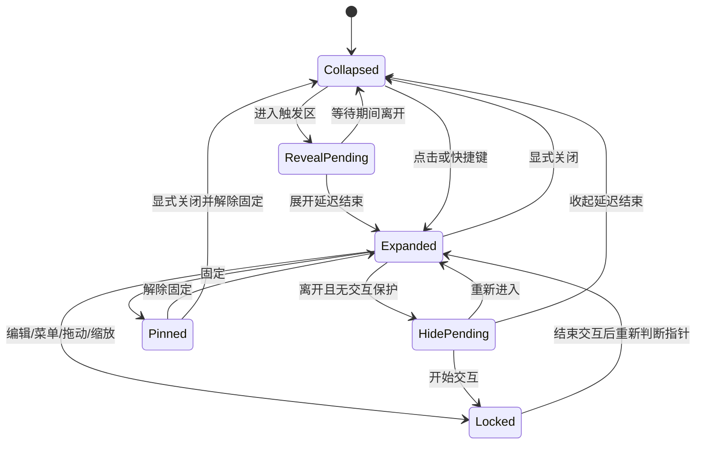

# 交互设计：控制台与边缘小窗

状态：交互契约，包含本阶段采用的回收站与草稿保护规则；不代表所有路径已验收。实际进展、测试数字与平台差距以 [STATUS](../delivery/STATUS.md) 为准。产品行为及需求来源以 [PRD](PRD.md) 为准。

## 大窗口控制台

主界面用于集中管理，采用正常可调整大小的系统窗口。以下是信息布局草案，不是最终视觉样式：

```text
┌──────────────────────────────────────────────────────────────┐
│ 侧笺 SideTask                                    ＋ 新建任务 │
├────────────┬──────────────────────────┬──────────────────────┤
│ 今日       │ 全部任务       排序 ▾   │ 任务详情             │
│ 全部任务   │                          │ 标题：提交课程作业   │
│ 截止日期   │ □ 提交课程作业   高     │ 截止：9月30日        │
│ 已完成     │   9月30日 · 已在今日     │ 重要程度：高         │
│            │ □ 交实验报告     普通   │ 备注：……             │
│            │   10月5日 · 加入今日     │                      │
│            │                          │ 已安排今日 ✓         │
│ 回收站     │                          │ 保存    标记完成     │
│ 设置       │                          │                      │
└────────────┴──────────────────────────┴──────────────────────┘
```

「今日」「全部任务」「截止日期」「已完成」「回收站」都是同一批大任务的不同视图。点击一条正常任务在详情栏编辑；回收站详情只读，先恢复再编辑。窄窗口改为任务详情页/抽屉，保证标题、DDL 和保存动作可见。第一版没有项目树、子任务按钮、任务内勾选清单、甘特图或百分比进度。

今日未完成任务提供“上移”“下移”“移出今日”操作；首项不能上移、末项不能下移，保存中禁用重复操作。上移/下移一次提交当天未删除、未完成计划的完整顺序，保存成功后大小窗共同更新；失败保留已提交顺序。已完成和回收站任务的计划位置、历史日期不参与此次整理。搜索筛选时不提供局部排序，避免看不见的任务被重排；清空搜索后可整理完整今日清单。移出只取消今天的安排，可从全部任务或此前未完成重新加入，不影响 DDL。

页面保持任务优先的左对齐布局。标题只说明当前视图；今日日期保留，待办 / 完成数放在列表标题行，不用独立完成圆环或统计卡。侧栏保留导航、设置与普通“打开小窗”入口，移除宣传卡和重复存储状态。霜序使用连续分组列表，暖刊仅在页面主标题保留宋体，其余任务和控件采用系统字体。四套可切换风格和任务行为继续保留；本轮修改减少视觉层级，不减少任务能力。

设置分组：

- **界面风格**：设置页首屏展示纸笺、霜序、暖刊、极简四张缩略卡。每张包含控制台和小窗示意、名称、特点与选中勾标。点击后仅提交 `uiStyle`，成功才切换并通知其他窗口；写入失败保留原外观。切换时保留设置页位置和未保存的其他设置草稿，不重新创建窗口、不改变任务。浅深色/跟随系统仍为独立偏好。

- **边缘小窗**：启用/暂停、当前停靠显示器、左/右边缘、沿边位置、宽高、呼出与收起延迟、固定展开/置顶选项。位置也能直接拖动调整。
- **外观**：浅色 / 深色 / 跟随系统用三个紧凑按钮选择，选中状态明确，不重复展示三张页面缩略图。明暗偏好与四套界面风格独立，仍随设置草稿保存。
- **通用**：快捷键、开机启动；额外快捷键/自启属于建议能力。
- **数据与关于**：存储状态、版本、完整任务备份的导出与恢复；整份备份恢复与单项回收站恢复分开呈现，不混入普通任务详情。

边缘小窗设置在用户点击应用且保存成功后更新。验证失败保留旧设置并给出错误；发生系统应用失败时展示实际生效值与重试入口，不能显示未生效的成功状态。更改显示器/位置时安全收起并重定位。控制台普通窗口尺寸与小窗尺寸分别保存。

## 控制台窗口偏好与失败反馈

主动启动恢复普通客户区尺寸、工作区相对位置和最大化偏好；不把上次隐藏、最小化或全屏当作下次不可见启动的指令。恢复与校准本身不抢焦点，只有启动、托盘或明确管理任务动作才显示/聚焦。普通大窗保留跨屏自由，位置无法操作时才校准；小工作区下仍可滚动到新建、详情和设置保存。

位置写入失败在工具栏下方显示“本次窗口位置未保存”和原因，提供“重试保存位置”“不保存本次位置”。重试保存点击时的实际位置；丢弃本次候选，不把窗口弹回旧位置，下次移动仍可保存。失败恢复不能重置任务、表单、搜索或导航；操作中只冻结这两个按钮，任务编辑继续可用。用户主动移走键盘焦点时不能抢回来；失败按钮重新启用后仍可用键盘重试。

关闭控制台仍隐藏并常驻；退出草稿门禁不变。位置保存失败不能让明确退出陷入循环。首次恢复失败时保留旧偏好，显示错误及恢复入口，不把部分位置/尺寸成功当完整保存。

## 回收站与任务恢复

回收站位于控制台侧栏底部，显示数量，沿用当前风格、列表密度和键盘操作。列表按移入时间倒序，同时间保持稳定次序；行内显示标题、原完成状态、DDL、移入时间和“恢复”。正常搜索包含未删除的未完成/已完成任务；进入回收站后搜索框改为“搜索回收站”，只在回收站内查标题和备注。今日、此前未完成、DDL、已完成及其数字都不包含回收站任务。

详情底部的“移入回收站”与“移出今日”“标记完成”分开。有草稿时显示“移入回收站前保留修改？”，提供三个明确选择：

| 操作 | 行为 |
| --- | --- |
| 继续编辑 | 关闭确认，保留原输入与焦点，不写入数据。 |
| 保存后移入 | 先保存草稿，再基于本次保存成功的版本移入。保存失败保留草稿；保存成功但移入失败时分别说明两个结果，任务仍可见。 |
| 放弃修改并移入 | 明确放弃未保存内容，只将已提交的任务移入；失败时任务和草稿仍保留。 |

无草稿时直接提交。成功后显示“已移入回收站”与“恢复”，任务从日常列表和小窗同步移除；键盘焦点移交相邻任务或列表。失败保留原界面并显示原因，不提前移除任务。恢复可以来自行内、详情或提示，均保留原 Task ID、DDL、完成时间和全部计划；原来已完成的任务仍已完成。跨天恢复不自动加入今天，原计划照既有规则显示。

恢复后提供“查看任务”，未完成任务定位“全部任务”，已完成任务定位“已完成”并打开详情；显式查看时将键盘焦点交给详情标题。提示中的导航也必须使用点击时最新的草稿状态，出现保存/放弃/继续编辑门禁时等待用户处理，不因提示到期跳过保护。后台更新不移动焦点或激活窗口。

另一个窗口删除正在编辑的任务时，保留原详情和输入，显示“任务已在另一处移入回收站，草稿仍保留”。表单暂为只读，恢复后通过现有冲突确认继续保存。行内恢复、详情恢复和提示恢复都不能因为条目从回收站消失而卸载仍有草稿的详情；恢复标记与离开编辑是两件独立的事。过期的“恢复”提示不能撤销后续一次新的删除。

空状态写“回收站为空”，说明任务会保留、可随时恢复；不出现自动清理倒计时或永久删除/清空入口。小窗继续用于日常任务，只通过完整编辑入口进入控制台管理回收站。

## 边缘小窗展开后的结构

```text
┌─────────────────────────────┐
│ 侧笺                 固定  × │
│ 9月24日 周四                │
│ 今日计划                2/5 │
│ □ 英语阅读 30 分钟          │
│ □ 提交课程作业  高  明天截止│
│ ▸ 此前未完成（2）           │
│ ▸ 已完成（2）               │
├──────── 可拖动分隔条 ───────┤
│ 截止日期          日期 ▾    │
│ □ 提交课程作业    明天      │
│   高 · 已在今日             │
│ □ 交实验报告      9月30日   │
│   普通        ＋ 加入今日   │
│ ▸ 已完成                   │
├─────────────────────────────┤
│ 管理任务       ＋新建  设置 │
└─────────────────────────────┘
```

上下区域独立滚动，标题和底部工具保留；可调整分隔条。缩到较小时仍保留两个区的标题与基本操作，不把 DDL 区挤到完全不可见。小窗任务标题最多显示两行，鼠标悬停可看全文，点击进入控制台详情查看完整内容；读屏名称保留全文。DDL 和勾选控件不被长标题挤掉。控制台正文仍可完整换行。

小窗顶部只显示紧凑日期，不显示口号或装饰太阳；各尺寸一致地把空间优先留给任务。最小尺寸须至少让两个分区的首项摘要、勾选及日期信息完整可见。

小窗底部“新建”入口唤醒控制台的新建任务表单；点击已有任务则打开控制台并定位当前 Task。小窗中的 DDL 任务与今日任务不是两份记录，控制台也没有额外副本。

小窗今日未完成行也可直接“移出今日”；完整上移/下移在控制台进行，小窗按共享计划顺序展示，不增加第二套排序偏好。

## 文案与反馈

界面文字用于解释状态或下一步动作。新建表单使用“新建任务”等直接标题；空状态区分今日尚未安排、没有截止任务、没有搜索结果；完成后显示结果并保留“撤销”。删除励志口号、装饰性说明和重复宣传，保留日期、优先级、冲突、失败与恢复所需的信息。修改视觉风格不能隐藏错误或把未保存状态说成已保存。

## 拖动小窗与停靠

沿屏幕边缘移动是明确需求。换边、主动换屏、吸附细节是目前的交互方案：

1. 收起时按住把手拖动，展开时按住标题空白区拖动。设置拖动阈值，点击和小幅晃动不误触发迁移；任务文字选择、列表滚动及尺寸手柄不当成拖窗。
2. 拖动期间暂停悬停/离开计时，取消旧计时回调，不自动收起。小窗可沿边移动，也可随用户主动拖动经过两屏接缝；收起状态只移动把手，不突然展开完整任务面板。
3. 释放在可用屏幕内时，选择该屏幕最近的合法左/右停靠边，拖动时可预览候选位置；松手后重新校准尺寸和缩放再停靠。接缝用平台返回的指针所属屏幕，结果不唯一时取最近一次有效候选；无有效候选则取消，避免来回跳动。
4. 释放在无效位置或收到原生拖动取消事件时返回此前的合法停靠位置；旧屏幕已断开时回退到可用屏幕。平台能在拖动会话接收 Esc 时，将它优先作为取消拖动处理；不能假定未获焦把手的 WebView 收得到 Esc，此项由双平台 POC 验证。恢复原有固定展开/收起状态，不丢任务草稿。
5. 停靠完成后一次保存新位置，避免每个移动事件都写数据库。保存失败提示并恢复最近已提交的合法位置；若控制台已提交新位置，应停止旧拖动并应用新配置，不能用旧快照覆盖。重新允许悬停前要求指针先离开触发区。

「固定」只表示持续展开，仍可移动和缩放。防止邻屏溢出从停靠完成后生效，尤其针对展开/收起动画；用户主动拖动跨屏不视为动画泄漏。拖动捕获、取消及跨 DPI 行为需要双平台 POC 验证。

## 两种窗口如何配合

| 操作 | 预期行为 |
| --- | --- |
| 小窗点管理任务 | 打开/唤醒唯一控制台，默认进入今日 |
| 小窗点设置 | 唤醒同一控制台并切到设置页 |
| 小窗点完整编辑 | 控制台按 Task ID 定位详情，先处理其他未保存编辑 |
| 托盘/菜单栏打开控制台 | 即使边缘入口被暂停，也能恢复管理界面 |
| 关闭大窗口 | 先处理未保存编辑，然后隐藏/关闭大窗；边缘功能继续运行 |
| 最小化大窗口 | 按系统习惯最小化，可再次打开；不会退出整个应用 |
| 明确退出 SideTask | 处理未保存修改，结束所有窗口、把手与后台服务 |
| 重复启动应用 | 复用已有进程和控制台；不生成第二个数据库写入者 |
| 控制台正在前台使用 | 暂停非固定小窗的悬停呼出；已有编辑先保存/取消，不悄悄隐藏草稿 |
| 小窗已固定 | 保留查看和勾选；完整编辑仍在控制台，不强行切焦点 |

两处同时编辑同一任务时，不用最后一次保存静默覆盖。遇到版本冲突，保留输入草稿，提示刷新最新任务后再提交。只是在一处完成/撤销任务时，另一处普通列表直接更新。

主动打开控制台可以激活应用；无意识经过屏幕边缘不应弹出控制台。用户从小窗进入控制台前若有未保存快速输入，先保存/取消，避免窗口切换造成丢失。关闭大窗后首次可用一次轻提示解释“仍在菜单栏/托盘运行”。

Windows 托盘左键抬起恢复同一控制台，右键保留打开、设置与退出菜单；使用应用彩色图标适配浅深任务栏。关闭控制台仍保持后台运行，退出仍走未保存草稿门禁。该入口实现与真实托盘点击验收分别记录。

## 出现与消失

1. 折叠时只显示小把手。进入指定区域并停留后展开；只是路过不会立刻打开。
2. 鼠标经过把手到面板之间的区域算作同一交互区，不应闪烁收起。
3. 离开整个面板及其子菜单后开始收起计时；重新进入则取消。
4. 点击固定后持续展开。点击关闭明确关闭并解除固定；解除固定后恢复自动收起。
5. 关闭后等鼠标离开触发区域再重新允许悬停打开，避免点完关闭立即弹回。
6. 快捷键/把手点击可显式切换；菜单栏/托盘提供打开、设置、退出作为恢复入口。

## 焦点与操作保护

悬停只是看：不自动把当前编辑器、浏览器或终端的键盘焦点切走。点击输入框或显式新建任务后才进入编辑。

编辑、中文输入法组合、日期/优先级菜单、选择文字、拖动把手、缩放窗口时暂停自动收起。保存/取消后释放保护，再按照鼠标位置决定是否收起。显式关闭时，未保存编辑需保存或给出保存/放弃选项。

`Esc` 优先关闭子菜单，其次取消编辑，最后关闭面板；IME 组合中的 Esc 交给输入法。悬停状态下键盘焦点仍在原应用，因此 Esc 只在面板已获得键盘焦点时处理；全局快捷键始终是备用关闭路径。

点击勾选后保留短暂反馈再放入已完成折叠区，提供撤销，避免列表移动导致连续误点。操作失败恢复原状态并展示明确错误。

## 状态机



图为交互概览；实际实现中「固定」与「交互保护计数」应是正交字段，避免固定状态编辑后丢失固定设置。显示器变化、睡眠、退出等系统事件可以中止计时；编辑数据独立保存，不能因窗口重建丢失。

## 首次使用

首次打开控制台，简短展示把手/小窗示例，选择放在哪块屏幕哪侧，再添加第一项大任务。用户主动再次启动应用打开控制台；登录自启仅恢复常驻入口，避免打断学习。开机启动是显式设置项。只有用户启用确实需要权限的能力时才解释并申请相应权限，不预先索要无关权限。

## 可访问性与干扰控制

- 鼠标和键盘都能新建、完成、排序、关闭；焦点顺序明确。
- 重要程度和逾期不能只靠颜色，配合文字及读屏标签。
- 遵循系统浅色/深色和减少动态效果偏好；不闪烁、不自动播放声音。
- 触发区不覆盖系统 Dock/任务栏等主要操作区；可调位置和等待时间。
- 输入菜单和弹层也要限制在目标屏幕可用区域内，优先在面板内部展示。

边缘小窗停靠后，所有可见部分留在当前停靠屏幕内；主动拖动可跨屏，结束后重新吸附并应用防溢出规则。控制台可以像普通窗口一样跨屏移动。恢复控制台时不能落在已断开的显示器之外。

## 本轮数据与退出交互

原生首次使用为空任务库，空状态说明新建、小窗与菜单栏/托盘恢复入口。设置的数据备份区导出到应用自管目录，显示可复制路径；导出包含回收站和全部计划。导入先选 JSON 并验证，再显示总任务、其中回收站、计划数量与导出时间。说明确认恢复将替换当前任务和回收站，并保留当前设备设置；先备份当前库再替换，不能暗示只会合并或恢复某项任务。旧版备份按其原有任务集合恢复。未保存草稿或在途写入时不能开始整份备份恢复；预览后任务改变须重新预览。

新建任务取消/Esc先保留或放弃草稿；详情、设置及新任务共同参与显式退出的保存/放弃/取消。保存期间冻结表单和导航，避免后续输入被完成回调覆盖。多层弹窗只由最上层处理Escape。设置已保存但系统应用失败时给出原因和重试；不以数据库提交冒充窗口同步。

## 已采用的分区比例交互

小窗今日/DDL分隔线可拖动，比例30–70%，默认54%；方向键每次5%，Home/End到边界。指针松手、键盘keyup或离开分隔线时保存一次，手势中只预览；取消或丢失捕获回到已保存值。保存期间禁止重复调整并暂停自动收起。失败保留所见比例，提供“重试保存”和“恢复已保存比例”；其他窗口修改同一比例时明确提示冲突，只有“使用此比例”才提交当前调整，其他设置保留。恢复或保存成功后，若原操作按钮消失且用户没有主动移焦，键盘焦点回到分隔线。

比例按当前两个内容区布局，不改变原生窗口尺寸、位置或显隐。分隔线提示说明拖动与键盘操作，四套明暗沿用原风格；最小窗口保留两区标题、恢复操作与底部管理入口。原生与双平台验收仍按STATUS，不以浏览器的命令记录代替。


## 小窗尺寸的保存与取消

拖尺寸握柄时以当前实际外框作预览；松手保存一次，单击未移动或拖回起点不保存。只调宽度时保留原高度偏好，只调高度时保留原宽度偏好。工作区暂时太小只限制实际窗口，不把被限制的另一轴自动写回偏好。

方向键按每步10逻辑像素累积，松键后保存；保存期间握柄标示忙碌并暂不接受新一轮调整，完成后可继续。Esc、指针取消、捕获丢失或窗口失焦取消尚未提交的调整。外部设置或目标屏幕/DPI改变会结束本次缩放并恢复最新保存设置，旧操作不能继续覆盖。

预览不逐帧写库。提交失败恢复原停靠位置和最新保存尺寸，错误保持可见；分区拖动与尺寸调整各自持有交互保护，结束其中一个不会解除另一个。普通窗口位置记忆、任务编辑和数据备份继续按各自流程工作。这里描述交互契约，真实键盘焦点、跨屏和系统取消是否通过仍分别记录原生验收。
