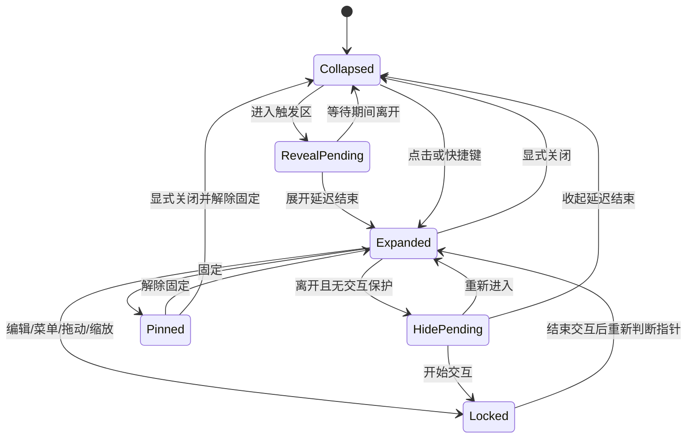

# 交互设计：控制台与边缘小窗

状态：交互基线，部分已实现为原型；未验证行为以 STATUS 为准。产品行为以 [PRD](PRD.md) 为准。

## 大窗口控制台

主界面用于集中管理，采用正常可调整大小的系统窗口。以下是信息布局草案，不是最终视觉样式：

```text
┌──────────────────────────────────────────────────────────────┐
│ 侧笺 SideTask                                    ＋ 新建任务 │
├────────────┬──────────────────────────┬──────────────────────┤
│ 今日       │ 全部任务       排序 ▾   │ 任务详情             │
│ 全部任务   │                          │ 标题：提交课程作业   │
│ 截止日期   │ □ 提交课程作业   高     │ 截止：9月30日        │
│ 已完成     │   9月30日 · 已在今日     │ 重要程度：高         │
│            │ □ 交实验报告     普通   │ 备注：……             │
│            │   10月5日 · 加入今日     │                      │
│            │                          │ 已安排今日 ✓         │
│            │                          │ 保存    标记完成     │
│ 设置       │                          │                      │
└────────────┴──────────────────────────┴──────────────────────┘
```

「今日」「全部任务」「截止日期」「已完成」都是同一批大任务的不同视图。点击一条任务在详情栏编辑，窄窗口改为任务详情页/抽屉，保证标题、DDL 和保存动作可见。第一版没有项目树、子任务按钮、任务内勾选清单、甘特图或百分比进度。

页面保持任务优先的左对齐布局。标题只说明当前视图；今日日期保留，待办 / 完成数放在列表标题行，不用独立完成圆环或统计卡。侧栏保留导航、设置与普通“打开小窗”入口，移除宣传卡和重复存储状态。霜序使用连续分组列表，暖刊仅在页面主标题保留宋体，其余任务和控件采用系统字体。四套可切换风格和任务行为继续保留；本轮修改减少视觉层级，不减少任务能力。

设置分组：

- **界面风格**：设置页首屏展示纸笺、霜序、暖刊、极简四张缩略卡。每张包含控制台和小窗示意、名称、特点与选中勾标。点击后仅提交 `uiStyle`，成功才切换并通知其他窗口；写入失败保留原外观。切换时保留设置页位置和未保存的其他设置草稿，不重新创建窗口、不改变任务。浅深色/跟随系统仍为独立偏好。

- **边缘小窗**：启用/暂停、当前停靠显示器、左/右边缘、沿边位置、宽高、呼出与收起延迟、固定展开/置顶选项。位置也能直接拖动调整。
- **外观**：浅色 / 深色 / 跟随系统用三个紧凑按钮选择，选中状态明确，不重复展示三张页面缩略图。明暗偏好与四套界面风格独立，仍随设置草稿保存。
- **通用**：快捷键、开机启动；额外快捷键/自启属于建议能力。
- **数据与关于**：存储状态、版本；导出和恢复作为建议补充，不混入普通任务详情。

边缘小窗设置在用户点击应用且保存成功后更新。验证失败保留旧设置并给出错误；发生系统应用失败时展示实际生效值与重试入口，不能显示未生效的成功状态。更改显示器/位置时安全收起并重定位。控制台普通窗口尺寸与小窗尺寸分别保存。

## 边缘小窗展开后的结构

```text
┌─────────────────────────────┐
│ 侧笺                 固定  × │
│ 9月24日 周四                │
│ 今日计划                2/5 │
│ □ 英语阅读 30 分钟          │
│ □ 提交课程作业  高  明天截止│
│ ▸ 此前未完成（2）           │
│ ▸ 已完成（2）               │
├──────── 可拖动分隔条 ───────┤
│ 截止日期          日期 ▾    │
│ □ 提交课程作业    明天      │
│   高 · 已在今日             │
│ □ 交实验报告      9月30日   │
│   普通        ＋ 加入今日   │
│ ▸ 已完成                   │
├─────────────────────────────┤
│ 管理任务       ＋新建  设置 │
└─────────────────────────────┘
```

上下区域独立滚动，标题和底部工具保留；可调整分隔条。缩到较小时仍保留两个区的标题与基本操作，不把 DDL 区挤到完全不可见。小窗任务标题最多显示两行，鼠标悬停可看全文，点击进入控制台详情查看完整内容；读屏名称保留全文。DDL 和勾选控件不被长标题挤掉。控制台正文仍可完整换行。

小窗顶部只显示紧凑日期，不显示口号或装饰太阳；各尺寸一致地把空间优先留给任务。最小尺寸须至少让两个分区的首项摘要、勾选及日期信息完整可见。

小窗底部“新建”入口唤醒控制台的新建任务表单；点击已有任务则打开控制台并定位当前 Task。小窗中的 DDL 任务与今日任务不是两份记录，控制台也没有额外副本。

## 文案与反馈

界面文字用于解释状态或下一步动作。新建表单使用“新建任务”等直接标题；空状态区分今日尚未安排、没有截止任务、没有搜索结果；完成后显示结果并保留“撤销”。删除励志口号、装饰性说明和重复宣传，保留日期、优先级、冲突、失败与恢复所需的信息。修改视觉风格不能隐藏错误或把未保存状态说成已保存。

## 拖动小窗与停靠

沿屏幕边缘移动是明确需求。换边、主动换屏、吸附细节是目前的交互方案：

1. 收起时按住把手拖动，展开时按住标题空白区拖动。设置拖动阈值，点击和小幅晃动不误触发迁移；任务文字选择、列表滚动及尺寸手柄不当成拖窗。
2. 拖动期间暂停悬停/离开计时，取消旧计时回调，不自动收起。小窗可沿边移动，也可随用户主动拖动经过两屏接缝；收起状态只移动把手，不突然展开完整任务面板。
3. 释放在可用屏幕内时，选择该屏幕最近的合法左/右停靠边，拖动时可预览候选位置；松手后重新校准尺寸和缩放再停靠。接缝用平台返回的指针所属屏幕，结果不唯一时取最近一次有效候选；无有效候选则取消，避免来回跳动。
4. 释放在无效位置或收到原生拖动取消事件时返回此前的合法停靠位置；旧屏幕已断开时回退到可用屏幕。平台能在拖动会话接收 Esc 时，将它优先作为取消拖动处理；不能假定未获焦把手的 WebView 收得到 Esc，此项由双平台 POC 验证。恢复原有固定展开/收起状态，不丢任务草稿。
5. 停靠完成后一次保存新位置，避免每个移动事件都写数据库。保存失败提示并恢复最近已提交的合法位置；若控制台已提交新位置，应停止旧拖动并应用新配置，不能用旧快照覆盖。重新允许悬停前要求指针先离开触发区。

「固定」只表示持续展开，仍可移动和缩放。防止邻屏溢出从停靠完成后生效，尤其针对展开/收起动画；用户主动拖动跨屏不视为动画泄漏。拖动捕获、取消及跨 DPI 行为需要双平台 POC 验证。

## 两种窗口如何配合

| 操作 | 预期行为 |
| --- | --- |
| 小窗点管理任务 | 打开/唤醒唯一控制台，默认进入今日 |
| 小窗点设置 | 唤醒同一控制台并切到设置页 |
| 小窗点完整编辑 | 控制台按 Task ID 定位详情，先处理其他未保存编辑 |
| 托盘/菜单栏打开控制台 | 即使边缘入口被暂停，也能恢复管理界面 |
| 关闭大窗口 | 先处理未保存编辑，然后隐藏/关闭大窗；边缘功能继续运行 |
| 最小化大窗口 | 按系统习惯最小化，可再次打开；不会退出整个应用 |
| 明确退出 SideTask | 处理未保存修改，结束所有窗口、把手与后台服务 |
| 重复启动应用 | 复用已有进程和控制台；不生成第二个数据库写入者 |
| 控制台正在前台使用 | 暂停非固定小窗的悬停呼出；已有编辑先保存/取消，不悄悄隐藏草稿 |
| 小窗已固定 | 保留查看和勾选；完整编辑仍在控制台，不强行切焦点 |

两处同时编辑同一任务时，不用最后一次保存静默覆盖。遇到版本冲突，保留输入草稿，提示刷新最新任务后再提交。只是在一处完成/撤销任务时，另一处普通列表直接更新。

主动打开控制台可以激活应用；无意识经过屏幕边缘不应弹出控制台。用户从小窗进入控制台前若有未保存快速输入，先保存/取消，避免窗口切换造成丢失。关闭大窗后首次可用一次轻提示解释“仍在菜单栏/托盘运行”。

## 出现与消失

1. 折叠时只显示小把手。进入指定区域并停留后展开；只是路过不会立刻打开。
2. 鼠标经过把手到面板之间的区域算作同一交互区，不应闪烁收起。
3. 离开整个面板及其子菜单后开始收起计时；重新进入则取消。
4. 点击固定后持续展开。点击关闭明确关闭并解除固定；解除固定后恢复自动收起。
5. 关闭后等鼠标离开触发区域再重新允许悬停打开，避免点完关闭立即弹回。
6. 快捷键/把手点击可显式切换；菜单栏/托盘提供打开、设置、退出作为恢复入口。

## 焦点与操作保护

悬停只是看：不自动把当前编辑器、浏览器或终端的键盘焦点切走。点击输入框或显式新建任务后才进入编辑。

编辑、中文输入法组合、日期/优先级菜单、选择文字、拖动把手、缩放窗口时暂停自动收起。保存/取消后释放保护，再按照鼠标位置决定是否收起。显式关闭时，未保存编辑需保存或给出保存/放弃选项。

`Esc` 优先关闭子菜单，其次取消编辑，最后关闭面板；IME 组合中的 Esc 交给输入法。悬停状态下键盘焦点仍在原应用，因此 Esc 只在面板已获得键盘焦点时处理；全局快捷键始终是备用关闭路径。

点击勾选后保留短暂反馈再放入已完成折叠区，提供撤销，避免列表移动导致连续误点。操作失败恢复原状态并展示明确错误。

## 状态机



图为交互概览；实际实现中「固定」与「交互保护计数」应是正交字段，避免固定状态编辑后丢失固定设置。显示器变化、睡眠、退出等系统事件可以中止计时；编辑数据独立保存，不能因窗口重建丢失。

## 首次使用

首次打开控制台，简短展示把手/小窗示例，选择放在哪块屏幕哪侧，再添加第一项大任务。用户主动再次启动应用打开控制台；登录自启仅恢复常驻入口，避免打断学习。开机启动是显式设置项。只有用户启用确实需要权限的能力时才解释并申请相应权限，不预先索要无关权限。

## 可访问性与干扰控制

- 鼠标和键盘都能新建、完成、排序、关闭；焦点顺序明确。
- 重要程度和逾期不能只靠颜色，配合文字及读屏标签。
- 遵循系统浅色/深色和减少动态效果偏好；不闪烁、不自动播放声音。
- 触发区不覆盖系统 Dock/任务栏等主要操作区；可调位置和等待时间。
- 输入菜单和弹层也要限制在目标屏幕可用区域内，优先在面板内部展示。

边缘小窗停靠后，所有可见部分留在当前停靠屏幕内；主动拖动可跨屏，结束后重新吸附并应用防溢出规则。控制台可以像普通窗口一样跨屏移动。恢复控制台时不能落在已断开的显示器之外。

## 本轮数据与退出交互

原生首次使用为空任务库，空状态说明新建、小窗与菜单栏/托盘恢复入口。设置的数据备份区导出到应用自管目录，显示可复制路径；导入先选JSON并验证，再显示任务/计划数量与导出时间，用户明确恢复后先备份当前库再替换。未保存草稿或在途写入时不能开始恢复；预览后任务改变须重新预览。

新建任务取消/Esc先保留或放弃草稿；详情、设置及新任务共同参与显式退出的保存/放弃/取消。保存期间冻结表单和导航，避免后续输入被完成回调覆盖。多层弹窗只由最上层处理Escape。设置已保存但系统应用失败时给出原因和重试；不以数据库提交冒充窗口同步。
